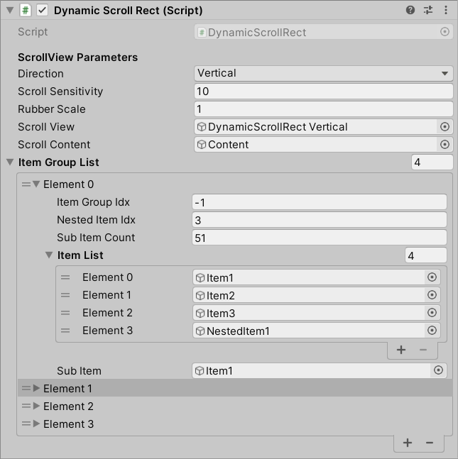
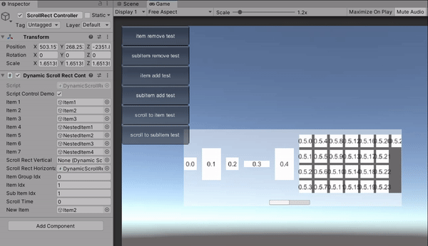
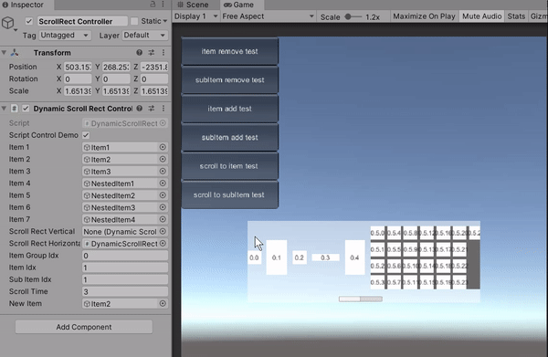

# Dynamic Scroll Rect V1.0

## Introduction

In many scenarios you might need a scrollable view to display a bunch of elements that cannot be displayed in one screen at the same time. In some cases you may also want to arrange the layout of scroll view vertically or horizontally while some elements in the scroll view contain their own layouts as well, such as developing a scroll view to display player inventory in which items should be categorized by their types.


The `ScrollView` component provided by Unity is a simple solution for your needs. However, `ScrollView` instanciates all elements and manage them at once, consuming a lot of resources on those elements that are not displayed. 
*DynamicScrollRect* provides a optimized solution for this scenarios. The scroll view will only instanciate those elements that are going to be displayed within the scroll view, saving a lot of draw calls and menory in use. *DynamicScrollRect* also support the nested layout structure mentioned above. If you are trying to display a large number of elements or construct a complex scroll view layout, *DynamicScrollRect* is absolutely what you need! 


You can see in the GIF below that elements that are outside of scroll view are removed and recycled and new elements are added to the scroll view when existing elements cannot fully fill the scroll view.


## Features
- Support nested layout group structure. That is, you can assign `LayoutGroup` component to the scroll content of *DynamicScrollRect* as a parent layout. And for items inside the scroll content, you can continue assign `LayoutGroup` to them as children layouts. (Noted that `GridLayoutGroup` is not allowed in scroll content)
- Take advantages of object pool. Reuse collectable oject to improve performance and menory usage.
- Support adding element to or removing element from scroll view during runtime.
- Support relocating scroll view to specific item group, item or subItem.
- Support scroll bar.


## Instructions

Different from the Unity *ScrollView* in which the element layout is managed by *ScrollView* itself, *DynamicScrollRect* divides the whole content into groups and manages them by `ItemGroupConfig` classes. By specifying the layout and hierarchy of the elements in item groups, you can obtain your desired scroll view layout. Below are two ways to configure item groups. 

+ ### Control with inspector
  You can configure item groups ahead in the Unity inspector panel. After attaching the *DynamicScrollRect* as a component of your object, *"Item Group List"* can be found in the *DynamicScrollRect* configuration panel. Each element in the *"Item Group List"* is an item group, you can configure the parameters of the item group in its panel. Noted that the order of elements in *'Item Group List'* will also determine the order of item groups displayed in the scroll view of *DynamicScrollRect*.

  - **Item Group Idx:** index of the item group in the item group list as well as in the scroll view of *DynamicScrollRect*. This is an optional parameter, as the program will automatically set its value during initialization.
  - **Nested Item Idx:** index of the item that contains subItems in this item group.
  - **SubItem Count:** number of subItem in this item group. If you don't need nested hierarchy in this item group, please set its value to smaller than 1.
  - **Item List:** list of item prefabs of this item group. The order in the list determines the order of items displayed in the scroll view of *DynamicScrollRect*.
  - **SubItem:** prefab of subItem.
  
  

+ ### Control with scripts
  *DynamicScrollRect* provides several APIs by which you can manage the scroll view using scripts.
  To initialize or manage scroll view before it enters runtime, you can use:
  - **`AddItemGroupStatic()`**
  - **`AlterItemGroupStatic()`**
  - **`RemoveItemGroupStatic()`**
  - **`AddItemStatic()`**
  - **`RemoveItemStatic()`**
  - **`AddSubItemStatic()`**
  - **`RemoveSubItemStatic()`**
  
  To mange scroll view during runtime, you can use:
  - **`AddItemDynamic()`**
  - **`RemoveItemDynamic()`**
  - **`AddSubItemDynamic()`**
  - **`RemoveSubItemDynamic()`**
  
  For more infromation about these APIs, please refer to **APIs** section below.

:exclamation: **Important remark** :exclamation:
Noted that `GridLayoutGroup` is not allowed in the scroll content of *DynamicScrollRect*, only `VerticalLayoutGroup` or `HorizontalLayoutGroup` is allowed. However, you can apply all these three types of layout group on the nested item. It is strongly recommended that don't add any child objects to a nested item as it might lead to incorrect display order right after you add subItems to the scroll view during gameplay.

There are two demo scenes in the Unity project for you to better understand how *DynamicScrollRect* works. They can be found in **./Asset/Demo** folder, marked as *'InspectorControlDemo'* and *'ScriptControlDemo'*. You will find an object called *'ScrollRect Controller'* in each scene, which provides you some tricks to manage *DynamicScrollRect* by script.

Basically, you can construct a *DynamicScrollRect* from scratch by adding *'DynamicScrollRect'* script as a component to the object you want it to be and then assign parameters that required by *DynamicScrollRect*. However, I strongly recommand you to use the *DynamicScrollRect* prefabs instead, with basic parameters are already configured. You can find them in **./Asset/Demo/Prefabs** folder.


*Demo of add/remove items/SubItems during gameplay*


*Demo of scroll to specific item*


## APIs

*DynamicScrollRect* provide several APIs and callback delegates for you to better manage the scroll view by script. They are listed as below: 

+ ### Inherit APIs
  *DynamicScrollRect* inherits several native Unity UGUI APIs including: `ICanvasElement`, `ILayoutElement`, `ILayoutGroup` and implements them within the code. You don't need to concern these APIs, but you need to be cautious before modifying these APIs as this might lead to unpredictable errors.

  ```csharp
  virtual void CalculateLayoutInputHorizontal()

  virtual void CalculateLayoutInputVertical()

  virtual void SetLayoutHorizontal()

  virtual void SetLayoutVertical()

  virtual void LayoutComplete()

  virtual void GraphicUpdateComplete()

  virtual void Rebuild(CanvasUpdate executing)
  ```

+ ### UI event APIs
  *DynamicScrollRect* also inherits native Unity event system APIs including: `IInitializePotentialDragHandler`, `IBeginDragHandler`, `IEndDragHandler`, `IDragHandler`, `IScrollHandler`. You can override these APIs according to your need.

  ```csharp
  virtual void OnInitializePotentialDrag(PointerEventData eventData)

  virtual void OnBeginDrag(PointerEventData eventData)

  virtual void OnDrag(PointerEventData eventData)

  virtual void OnEndDrag(PointerEventData eventData)

  virtual void OnScroll(PointerEventData data)
  ```

+ ### Scrollview alter APIs
  You can use these APIs to manage the scroll view before or during runtime. Noted that those APIs' names end with *"Static"* should be called when the scroll view is not in runtime. While those APIs' names end with *Dynamic* should be called when the scroll view is during runtime.

  ```csharp
  void AddItemGroupStatic(int nestItemIdx, int subItemCount, List<GameObject> itemList, GameObject subItem)
  /* Add an item group. You need to specify those basic parameters of the item group. */

  void AlterItemGroupStatic(int itemGroupIdx, int? nestItemIdx, int? subItemCount, List<GameObject> itemList = null, GameObject subItem = null)
  /* Alter the configuration of an existing item group. You need to specify the index of item group you want to alter. */

  void RemoveItemGroupStatic(int itemGroupIdx)
  /* Remove an existing item group. */

  void RefillScrollContent(int itemGroupBeginIdx = 0, float contentOffset = 0f)
  /* Refill the whole scroll view. You can specify the starting item group of the updated scroll view. */

  void AddItemStatic(int itemGroupIdx, int itemIdx, GameObject itemPrefab)
  /* Add an item to an existing item group. You need to specify the index of the new item and provide its prefab. */

  void AddItemDynamic(int itemGroupIdx, int itemIdx, GameObject itemPrefab)
  /* Add an item to an existing item group during gameplay. */

  void RemoveItemStatic(int itemGroupIdx, int itemIdx)
  /* Remove an item from an existing item group. */

  void RemoveItemDynamic(int itemGroupIdx, int itemIdx)
  /* Remove an item from an item group during gameplay. */

  void AddSubItemStatic(int itemGroupIdx)
  /* Add a subItem to the nested item of an existing item group. Since subItems are using the same prefab, you don't need to specify the index and prefab of the new subItem. */

  void AddSubItemDynamic(int itemGroupIdx, int subItemIdx)
  /* Add a subItem to an item group during gameplay. Since subItems are instanciated and set as the children of the nested item during gameplay, you need to specify the location of the new subItem when adding it. */

  void RemoveSubItemStatic(int itemGroupIdx)
  /* Remove a subItem from an existing item group. */

  void RemoveSubItemDynamic(int itemGroupIdx, int subItemIdx)
  /* Remove a subItem from an item group during gameplay. */
  ```

+ ### Scrollview alter callbacks
  You may need to initialize the item or subItem right after you add it to the scroll view, or you may need to execute some logic right after you remove an item or subItem. *DynamicScrollRect* provides several callback delegates to meet your demands.

  ```csharp
  delegate void OnSpawnItemAtStartDelegate(ItemGroupConfig itemGroup, GameObject item = null);
  event OnSpawnItemAtStartDelegate OnSpawnItemAtStartEvent;
  /* Callback when DynamicScrollRect add item at the start of scrollview. */
  
  delegate void OnSpawnItemAtEndDelegate(ItemGroupConfig itemGroup, GameObject item = null);
  event OnSpawnItemAtEndDelegate OnSpawnItemAtEndEvent;
  /* Callback when DynamicScrollRect add item at the end of scrollview. */
  
  delegate void OnSpawnSubItemAtStartDelegate(ItemGroupConfig itemGroup, GameObject subItem = null);
  event OnSpawnSubItemAtStartDelegate OnSpawnSubItemAtStartEvent;
  /* Callback when DynamicScrollRect add subItem at the start of scrollview. */
  
  delegate void OnSpawnSubItemAtEndDelegate(ItemGroupConfig itemGroup, GameObject subItem = null);
  event OnSpawnSubItemAtEndDelegate OnSpawnSubItemAtEndEvent;
  /* Callback when DynamicScrollRect add subItem at the end of scrollview. */
  
  delegate void OnDespawnItemAtStartDelegate(ItemGroupConfig itemGroup, GameObject item = null);
  event OnDespawnItemAtStartDelegate OnDespawnItemAtStartEvent;
  /* Callback when DynamicScrollRect remove item at the start of scrollview. */
  
  delegate void OnDespawnItemAtEndDelegate(ItemGroupConfig itemGroup, GameObject item = null);
  event OnDespawnItemAtEndDelegate OnDespawnItemAtEndEvent;
  /* Callback when DynamicScrollRect remove item at the end of scrollview. */
  
  delegate void OnDespawnSubItemAtStartDelegate(ItemGroupConfig itemGroup, GameObject subItem = null);
  event OnDespawnSubItemAtStartDelegate OnDespawnSubItemAtStartEvent;
  /* Callback when DynamicScrollRect remove subItem at the start of scrollview. */    
  
  delegate void OnDespawnSubItemAtEndDelegate(ItemGroupConfig itemGroup, GameObject subItem = null);
  event OnDespawnSubItemAtEndDelegate OnDespawnSubItemAtEndEvent;
  /* Callback when DynamicScrollRect remove subItem at the end of scrollview. */    
  
  delegate void OnAddItemDynamicDelegate(ItemGroupConfig itemGroup, GameObject item = null);
  event OnAddItemDynamicDelegate OnAddItemDynamicEvent;
  /* Callback when you add item to the scroll view during gameplay */     
  
  delegate void OnRemoveItemDynamicDelegate(ItemGroupConfig itemGroup, GameObject item = null);
  event OnRemoveItemDynamicDelegate OnRemoveItemDynamicEvent;
  /* Callback when you remove item from the scroll view during gameplay */      
  
  delegate void OnAddSubItemDynamicDelegate(ItemGroupConfig itemGroup, GameObject subItem = null, GameObject oldSubItem = null);
  event OnAddSubItemDynamicDelegate OnAddSubItemDynamicEvent;
  /* Callback when you add subItem to the scroll view during gameplay */    
  
  delegate void OnRemoveSubItemDynamicDelegate(ItemGroupConfig itemGroup, GameObject subItem = null, GameObject newSubItem = null);
  event OnRemoveSubItemDynamicDelegate OnRemoveSubItemDynamicEvent;
  /* Callback when you remove subItem from the scroll view during gameplay */    
  ``` 

+ ### Scrollview relocation APIs
  You can use these APIs to conveniently jump to specific item group, item and subItem. *DynamicScrollRect* uses a coroutine to relocate the scroll view to the destinated location, you can specify the time that relocation takes.

  ```csharp
  void ScrollToItemGroup(int itemGroupIdx, float time)
  /* Jump to specific item group. */

  void ScrollToItem(int itemGroupIdx, int itemIdx, float time)
  /* Jump to specific item. */

  void ScrollToSubItem(int itemGroupIdx, int subItemIdx, float time)
  /* Jump to specific subItem. */

  IEnumerator ScrollTo(float offsetSize, float time, bool upward)
  /* Relocate for 'offsetSize' amount of distance */
  ```


## Future Plans

Some functions are still under development, for example:
- Add support to reverse scroll direction.
- Add support to add and remove item groups during gameplay.
- Improve performance

If you have any new functions that want to add to *DynamicScrollRect* or discover any bugs, please feel free to write them down in [Issues](https://github.com/WaterFriend/DynamicScrollRect/issues) page of this repository.


## References

ivomarel's [InfinityScroll](https://github.com/ivomarel/InfinityScroll) 
qiankanglai's [LoopScrollRect](https://github.com/qiankanglai/LoopScrollRect)